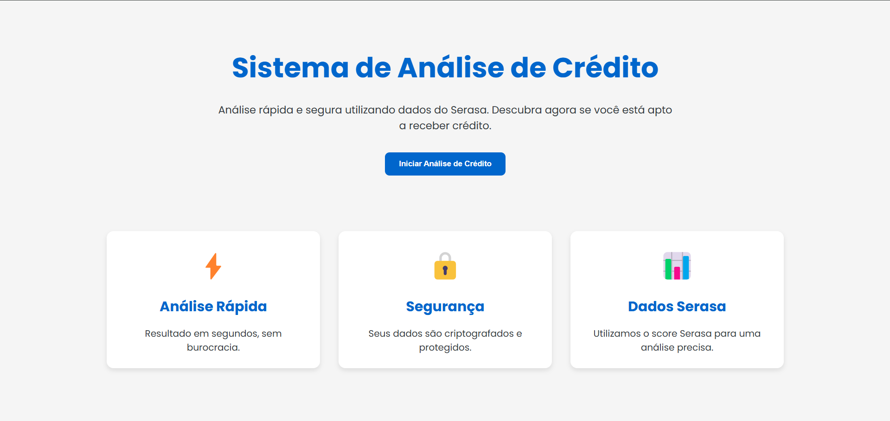

<h1 align="center">
   
  Sitema de Análise de Crédito
</h1>

<h1>
        
    
## 📕 About

The Credit Analysis System is a complete web application designed to assess users' eligibility for credit approval, using the Serasa score as the main evaluation criterion.

The platform allows users to submit their personal and financial data through an intuitive form, instantly receiving a response regarding credit approval, approved amount, applicable interest rate, and maximum repayment term.

The system's key differentiator lies in its integration with Serasa, leveraging its reliable database to ensure accurate and secure credit assessments, minimizing risks for financial institutions while providing users with a fair evaluation of their creditworthiness.
</h1>

  <a href="#rocket-technologies">Technologies</a>&nbsp;&nbsp;&nbsp;|&nbsp;&nbsp;&nbsp;
  <a href="#memo-license">License</a>

## 🚀 Technologies
This project was developed with the following technologies:

### Frontend

- [React](https://reactjs.org/) 
- [Vite](https://vitejs.dev/) 
- [styled-components](https://styled-components.com/) 
- [React-Router-Dom](https://reactrouter.com/en/main) 
- [Axios](https://axios-http.com/docs/intro) 
- [Yarn](https://yarnpkg.com/) 

### Backend
- [Node.js](https://nodejs.org/en/) 
- [Express](https://expressjs.com/pt-br/) 
- [MongoDB](https://www.mongodb.com/) 
- [Mongoose](https://mongoosejs.com/) 
- [Joi](https://joi.dev/) 
- [Winston](https://github.com/winstonjs/winston) 
- [Dotenv](https://www.npmjs.com/package/dotenv) 

## 📝License

This project is under the MIT license. See the [LICENSE](https://github.com/joaovictorsenna/credit-analysis-system.git) for more information.

---

Made with 🤍 by João Victor Sena 👋 [Get in touch!](https://www.linkedin.com/in/joao-victor-sena-lopes/)
